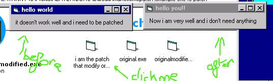



## MAKE SOME PATCH

### Description

before,sorry for my poor english...

All that is need to make some patch and store them... Make autoexec patch... store keys for your application... give the original file, the result file and this prog stores the patch to correct the first .exe file... the first and the second file must have same size and autoexec patch must be placed in the original exefile directory... extract the code/zip file with subdirectories... I store juste positon of <>bytes (original XOR patched <>0) for the patch the advantages of this method is thad the patch is not a big file and if you use the patch two times, you transform the patched file (in case of wrong file version for ex) in the original exe file............PLEASE VOTE FOR ME.............
 
### More Info
 

             |
---                |---
**Submitted On**   |2001-10-16 16:57:02
**By**             |[COEYMAN Christophe](https://github.com/Planet-Source-Code/PSCIndex/blob/master/ByAuthor/coeyman-christophe.md)
**Level**          |Intermediate
**User Rating**    |4.2 (55 globes from 13 users)
**Compatibility**  |VB 5\.0, VB 6\.0
**Category**       |[Complete Applications](https://github.com/Planet-Source-Code/PSCIndex/blob/master/ByCategory/complete-applications__1-27.md)
**World**          |[Visual Basic](https://github.com/Planet-Source-Code/PSCIndex/blob/master/ByWorld/visual-basic.md)
**Archive File**   |[CODE\_UPLOAD1262012122000\.zip](https://github.com/Planet-Source-Code/coeyman-christophe-make-some-patch__1-13542/archive/master.zip)

